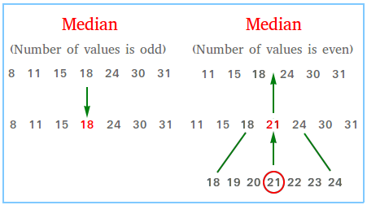
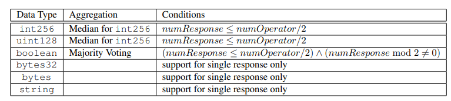

**Introduction**

Agentic Data Coordination Service (ADCS) is a service that allows AI Agents to have access to authentic, aggregated data for decision making.
**Components**
**Fetcher nodes V1**
The goal of fetcher is to fetch data from different sources, base on the definition inside data adapter.
Data adapter shema
```
{
  "adapterHash": "0xd18f6885ba66c44550c73b4b8a16702bf70e654d9f17d80b4451f80ec616bc60",
  "name": "BTC-USDT",
  "decimals": 8,
  "feeds": [
    {
      "name": "Bybit-BTC-USDT",
      "definition": {
        "url": "https://api.bybit.com/derivatives/v3/public/tickers?symbol=BTCUSDT",
        "headers": { "Content-Type": "application/json" },
        "method": "GET",
        "reducers": [
          { "function": "PARSE", "args": ["result", "list"] },
          { "function": "INDEX", "args": 0 },
          { "function": "PARSE", "args": ["lastPrice"] },
          { "function": "POW10", "args": 8 },
          { "function": "ROUND" }
        ]
      }
    },
    {
      "name": "Binance-BTC-USDT",
      "definition": {
        "url": "https://api.binance.com/api/v3/avgPrice?symbol=BTCUSDT",
        "headers": { "Content-Type": "application/json" },
        "method": "GET",
        "reducers": [
          { "function": "PARSE", "args": ["price"] },
          { "function": "POW10", "args": 8 },
          { "function": "ROUND" }
        ]
      }
    },
    {
      "name": "Coinbase-BTC-USDT",
      "definition": {
        "url": "https://api.coinbase.com/v2/exchange-rates?currency=BTC",
        "headers": { "Content-Type": "application/json" },
        "method": "GET",
        "reducers": [
          { "function": "PARSE", "args": ["data", "rates", "USDT"] },
          { "function": "POW10", "args": 8 },
          { "function": "ROUND" }
        ]
      }
    },
    {
      "name": "Kucoin-BTC-USDT",
      "definition": {
        "url": "https://api.kucoin.com/api/v1/market/orderbook/level1?symbol=BTC-USDT",
        "headers": { "Content-Type": "application/json" },
        "method": "GET",
        "reducers": [
          { "function": "PARSE", "args": ["data", "price"] },
          { "function": "POW10", "args": 8 },
          { "function": "ROUND" }
        ]
      }
    },
    {
      "name": "Crypto-BTC-USDT",
      "definition": {
        "url": "https://api.crypto.com/v2/public/get-ticker?instrument_name=BTC_USDT",
        "headers": { "Content-Type": "application/json" },
        "method": "GET",
        "reducers": [
          { "function": "PARSE", "args": ["result", "data"] },
          { "function": "INDEX", "args": 0 },
          { "function": "PARSE", "args": ["a"] },
          { "function": "POW10", "args": 8 },
          { "function": "ROUND" }
        ]
      }
    },
    {
      "name": "Btse-BTC-USDT",
      "definition": {
        "url": "https://api.btse.com/spot/api/v3.2/price?symbol=BTC-USDT",
        "headers": { "Content-Type": "application/json" },
        "method": "GET",
        "reducers": [
          { "function": "INDEX", "args": 0 },
          { "function": "PARSE", "args": ["indexPrice"] },
          { "function": "POW10", "args": 8 },
          { "function": "ROUND" }
        ]
      }
    },
    {
      "name": "Gateio-BTC-USDT",
      "definition": {
        "url": "https://api.gateio.ws/api/v4/spot/tickers?currency_pair=BTC_USDT",
        "headers": { "Content-Type": "application/json" },
        "method": "GET",
        "reducers": [
          { "function": "INDEX", "args": 0 },
          { "function": "PARSE", "args": ["last"] },
          { "function": "POW10", "args": 8 },
          { "function": "ROUND" }
        ]
      }
    },
    {
      "name": "Coinex-BTC-USDT",
      "definition": {
        "url": "https://api.coinex.com/v1/market/ticker?market=BTCUSDT",
        "headers": { "Content-Type": "application/json" },
        "method": "GET",
        "reducers": [
          { "function": "PARSE", "args": ["data", "ticker", "last"] },
          { "function": "POW10", "args": 8 },
          { "function": "ROUND" }
        ]
      }
    },
    {
      "name": "UniswapV3-0.3-WBTC-USDT",
      "definition": {
        "chainId": "1",
        "address": "0x9db9e0e53058c89e5b94e29621a205198648425b",
        "type": "UniswapPool",
        "token0Decimals": 8,
        "token1Decimals": 6
      }
    }
  ]
}
```
**Data post processing functions**

• path - list of keys for walk through input JSON
• index - access n-th item in the input list
• mul - multiply input with arbitrary number
• div - divide input with arbitrary number
• pow10 - compute a power of 10 from input
• round - apply a round operation on input

**Aggregator**
Aggregator aggregates the data retrieved from the fetchers and provide the the final, aggregated data:

Aggregator templates:

```
{
  "aggregatorHash": "0x1e1527bed9c502c27cd51b24350a3e4308b55d44598635f731264b3d579d7e5e",
  "name": "BTC-USDT",
  "heartbeat": 15000,
  "threshold": 0.05,
  "absoluteThreshold": 0.1,
  "adapterHash": "0xd18f6885ba66c44550c73b4b8a16702bf70e654d9f17d80b4451f80ec616bc60"
}
```
**Methods of aggregation**

Base on the datatypes, we can apply different aggregation methods, some of which that we use:

<strong>Median<strong>



<strong>Majority voting - the quantity of instances must be an odd number<strong>


**Our supported datatypes and aggregation methods**




