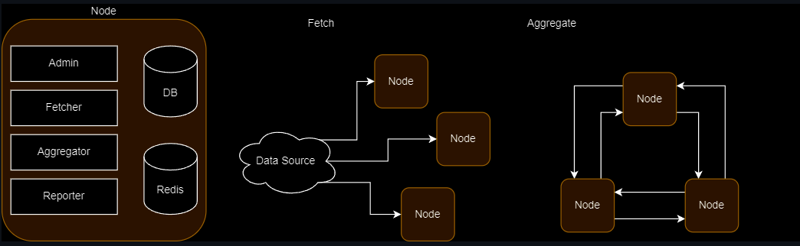
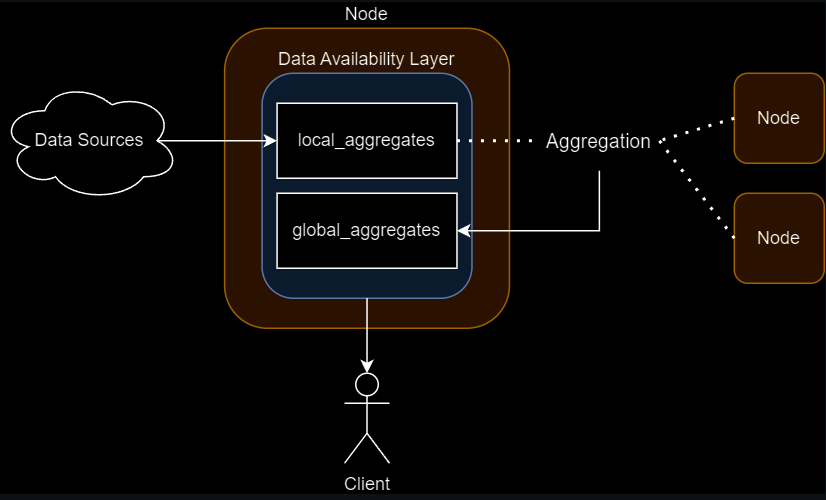
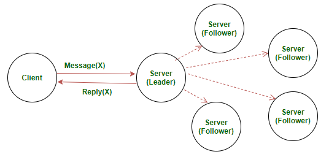

**Introduction**

Agentic Data Coordination Service (ADCS) is a service that allows AI Agents to have access to authentic, aggregated data for decision making.\
**Components**\
**Fetcher nodes V1**
The goal of fetcher is to fetch data from different sources, base on the definition inside data adapter.
Data adapter shema
```
{
  "adapterHash": "0xd18f6885ba66c44550c73b4b8a16702bf70e654d9f17d80b4451f80ec616bc60",
  "categoryID": 1
  "name": "BTC-USDT",
  "returnData": {
    "datatType": "number",
     "decimals": 8,
  }
  "dataSources": [
    {
      "provider": "Bybit-BTC-USDT",
      "definition": {
        "url": "https://api.bybit.com/derivatives/v3/public/tickers?symbol=BTCUSDT",
        "headers": { "Content-Type": "application/json" },
        "method": "GET",
        "reducers": [
          { "function": "PARSE", "args": ["result", "list"] },
          { "function": "INDEX", "args": 0 },
          { "function": "PARSE", "args": ["lastPrice"] },
          { "function": "POW10", "args": 8 },
          { "function": "ROUND" }
        ]
      }
    },
    {
      "provider": "UniswapV3-0.3-WBTC-USDT",
      "definition": {
        "chainId": "1",
        "address": "0x9db9e0e53058c89e5b94e29621a205198648425b",
        "type": "UniswapPool",
        "token0Decimals": 8,
        "token1Decimals": 6
      }
    }
  ]
}
```
**Data post processing functions**

• path - list of keys for walk through input JSON \
• index - access n-th item in the input list \
• mul - multiply input with arbitrary number \
• div - divide input with arbitrary number \
• pow10 - compute a power of 10 from input \
• round - apply a round operation on input \

**Aggregator** \
Aggregator aggregates the data retrieved from the fetchers and provide the the final, aggregated data:

Aggregator templates:

```
{
  "aggregatorHash": "0x1e1527bed9c502c27cd51b24350a3e4308b55d44598635f731264b3d579d7e5e",
  "name": "BTC-USDT",
  "heartbeat": 15000,
  "threshold": 0.05,
  "absoluteThreshold": 0.1,
  "adapterHash": "0xd18f6885ba66c44550c73b4b8a16702bf70e654d9f17d80b4451f80ec616bc60"
}
```
**Methods of aggregation**

Base on the datatypes, we can apply different aggregation methods, some of which that we use:

<strong>Median<strong>


<strong>Majority voting - the quantity of instances must be an odd number<strong>


**Our supported datatypes and aggregation methods**


**Create embeddings vector via Rivalz**

For AI agents compatibility, we store all the aggregated data inside [Rivalz ecosytem](https://rivalz.ai/)

The ecosystem highly ultilize the orbit vector DB, which is built on top of IPFS.\
In order to retrieve the data, you need to use the rivalz SDK, which is currently supported in:\
[python - Pypi](https://pypi.org/project/rivalz-client/0.1.12/)\
[source code](https://github.com/Rivalz-ai/python-client)

In order to use the SDK, you will need an API key, for early access, please contact us at: support@rivalz.ai

```
from rivalz_client.client import RivalzClient

# Initialize the client with your secret token
client = RivalzClient('your_secret_token')
```

You will also need the IPFS hash of the file to download it and use it as embeddings inside your AI Agents

```
file_path = client.download_file('QmSampleHash', 'save/directory')
print(f"File downloaded to: {file_path}")
```

For more information about using the Rivalz python client, please read here
[Rivalz readme](https://github.com/Rivalz-ai/python-client/blob/master/readme.md)

**ADCS decentralizations - introduction to ADCS fetcher nodes**

To maintain the integrity of data, we can opensource our fetcher node so that everyone can run a node and secure the network
Each node will have it owns copy of aggregated data and agrees upon other nodes via raft consensensus mechanism



In each node store a local aggregate and a global aggregate, when the consensus is reached the globale aggregate is the final data for storage






**Disclaimer**\
ADCS is under active developement, some of the information in this document may be outdated

